# Academic Activity Tracking System (AAT)
### Usability Document & User Guide

---

## 📋 Table of Contents

1. [Introduction](#1-introduction)
2. [General Navigation & Dashboard](#2-general-navigation--dashboard)
3. [Administrator Guide](#3-administrator-guide)
   - [3.1 Flow Overview: Administrative Curriculum Setup](#31-flow-overview-administrative-curriculum-setup)
   - [3.2 Staff Management & Onboarding](#32-staff-management--onboarding)
   - [3.3 Curriculum Setup (Programmes, Batches, & Courses)](#33-curriculum-setup-programmes-batches--courses)
   - [3.4 Academic Calendar & Weeks Management](#34-academic-calendar--weeks-management)
   - [3.5 Compliance Auditing & Reporting](#35-compliance-auditing--reporting)
4. [Faculty (Staff) Guide](#4-faculty-staff-guide)
   - [4.1 Flow Overview: Faculty Weekly Session Logging](#41-flow-overview-faculty-weekly-session-logging)
   - [4.2 Submitting Weekly Sessions (Step-by-Step)](#42-submitting-weekly-sessions-step-by-step)

---

## 1. Introduction

Welcome to the **Academic Activity Tracking System (AAT)**. This platform is designed to seamlessly monitor and record academic workloads, ensuring that planned curriculum hours perfectly align with the actual sessions delivered by the faculty.

This comprehensive user guide is split into two primary sections:

- **Administrator Guide** — for curriculum setup and compliance auditing
- **Faculty Guide** — for weekly session logging

---

## 2. General Navigation & Dashboard

When you log into the AAT system, you will be greeted by the primary dashboard. This interface adapts dynamically based on your role (**Admin** or **Staff**).

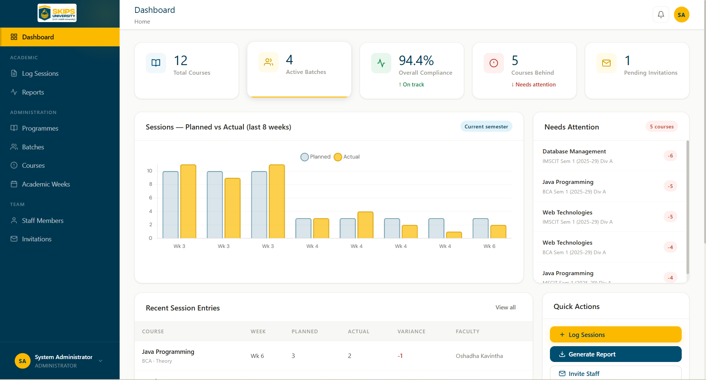`

### Key UI Elements

- **Sidebar Navigation** — Use the left-hand sidebar to jump between modules such as Staff Management, Programmes, Academic Weeks, Sessions, and your profile dropdown for account settings.
- **Top Bar** — Contains quick-access notifications.

---

## 3. Administrator Guide

The Administrator possesses full control over the structural setup of the system. Your primary goal is to establish the curriculum, invite faculty, set the calendar, and generate compliance reports.

---

### 3.1 Flow Overview: Administrative Curriculum Setup

Before detailing the individual steps, it is highly recommended to understand the holistic flow of deploying a curriculum.

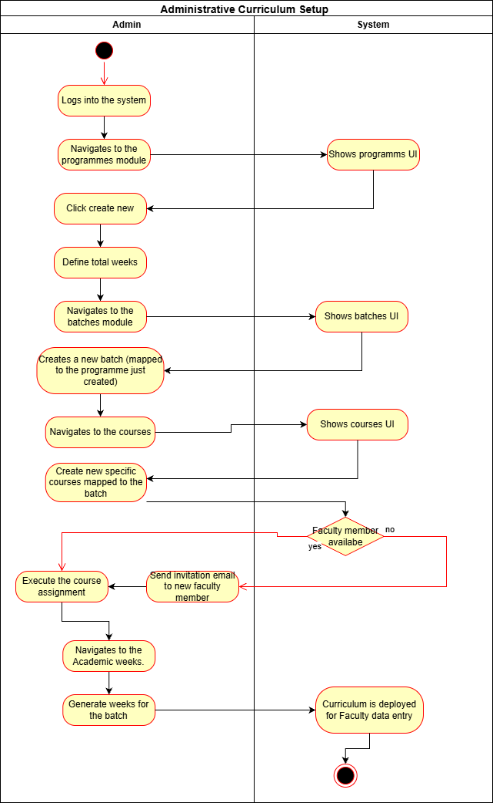`

---

### 3.2 Staff Management & Onboarding

Before assigning courses, you must onboard your faculty members.

**Steps:**

1. Navigate to the **Staff Members** or **Team** module from the sidebar. Here, you can view all active personnel.

   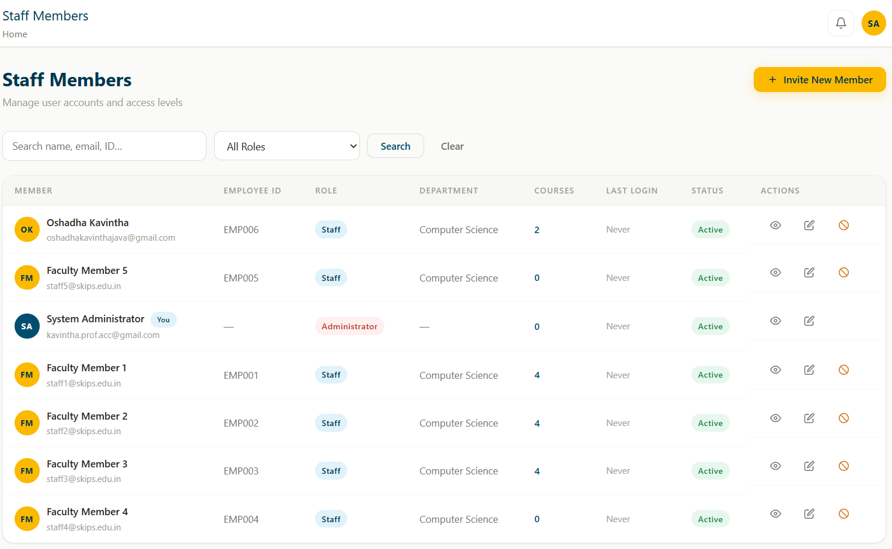`

2. Click the **Invite New Member** button.

3. Enter the faculty member's **Email Address** and **Role**. The system will dispatch a secure, time-sensitive cryptographic link to their email to complete their account creation.

   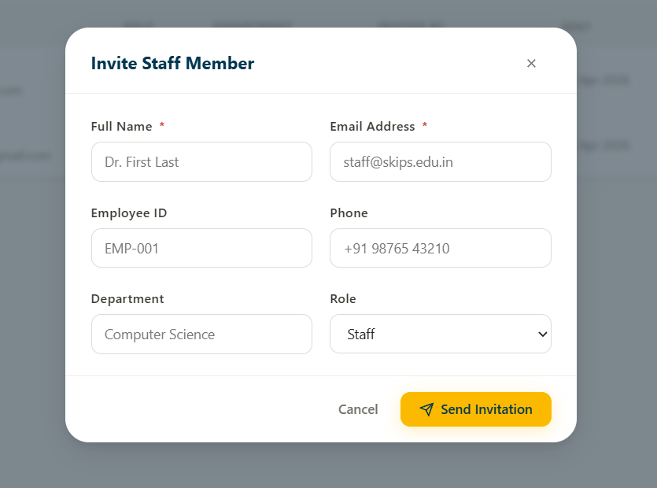`

---

### 3.3 Curriculum Setup (Programmes, Batches, & Courses)

The curriculum must be structured **hierarchically**: Programme → Batch → Course.

---

#### Step 1: Create a Programme

1. Navigate to **Programmes** and click **Create Programme**.
2. Enter the **Programme Name** (e.g., `BSc IT`) and, crucially, define the **Total Weeks** expected for a standard semester. This dictates automatic target calculations.

   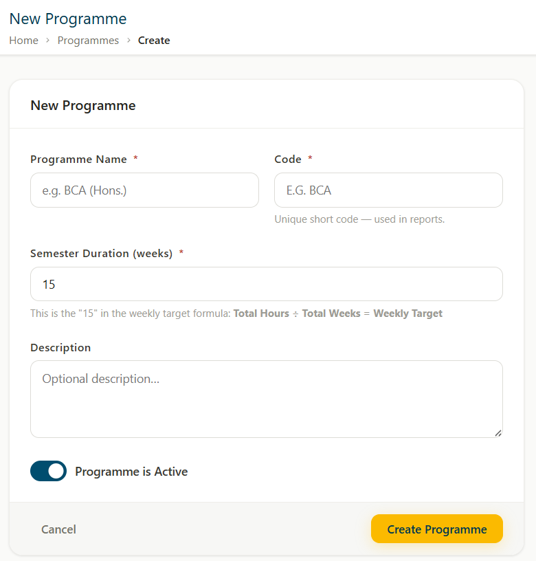`

---

#### Step 2: Create a Batch

1. Navigate to **Batches** and click **Create Batch**.
2. Link the Batch to a previously created Programme to establish the cohort (e.g., `Batch 2024–2028`).

   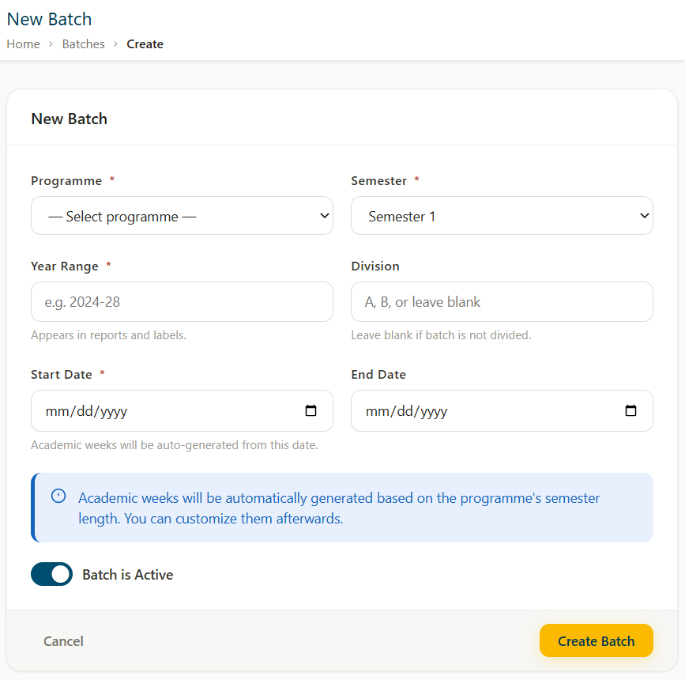`

---

#### Step 3: Create Courses & Assign Faculty

1. Navigate to **Courses** and click **Create Course**.
2. Select the parent **Batch**, enter the **Course Name/Code**, and define the **Total Hours** and **Type** (Theory / Practical).
3. Under the **Assign Faculty** section, select the newly onboarded staff members who will be responsible for teaching this course.

   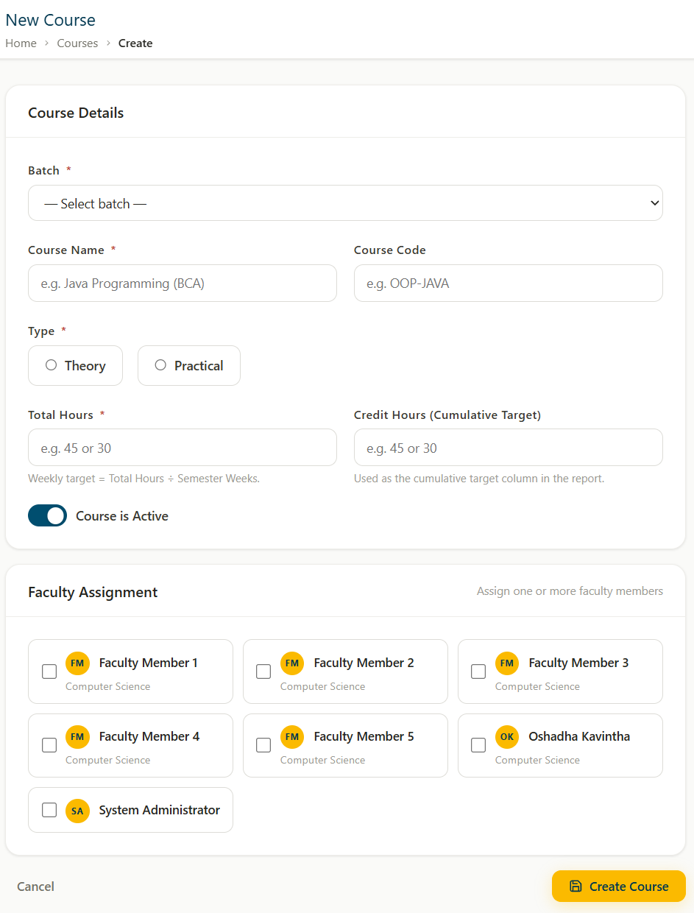`

---

### 3.4 Academic Calendar & Weeks Management

> ⚠️ **Important:** Faculty cannot log sessions unless an Administrator actively opens an "Academic Week".

1. Navigate to **Academic Weeks**. Here you can view all scheduled weeks for a specific batch.

   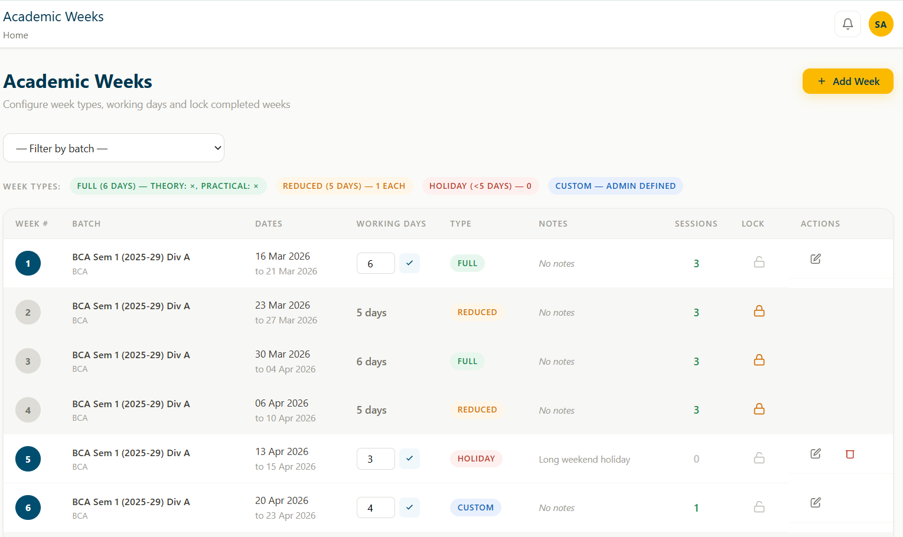`

2. Click **Create New Academic Week**.

3. Select the **Batch**, define the **Start/End dates**, and select the **Week Type**:

   | Week Type | Description |
   |-----------|-------------|
   | `Full`    | Standard full week |
   | `Reduced` | Partially reduced schedule |
   | `Holiday` | No sessions expected |
   | `Custom`  | Manually defined targets |

   > 🔔 *The system intelligently alters faculty targets based on the Week Type you choose.*

   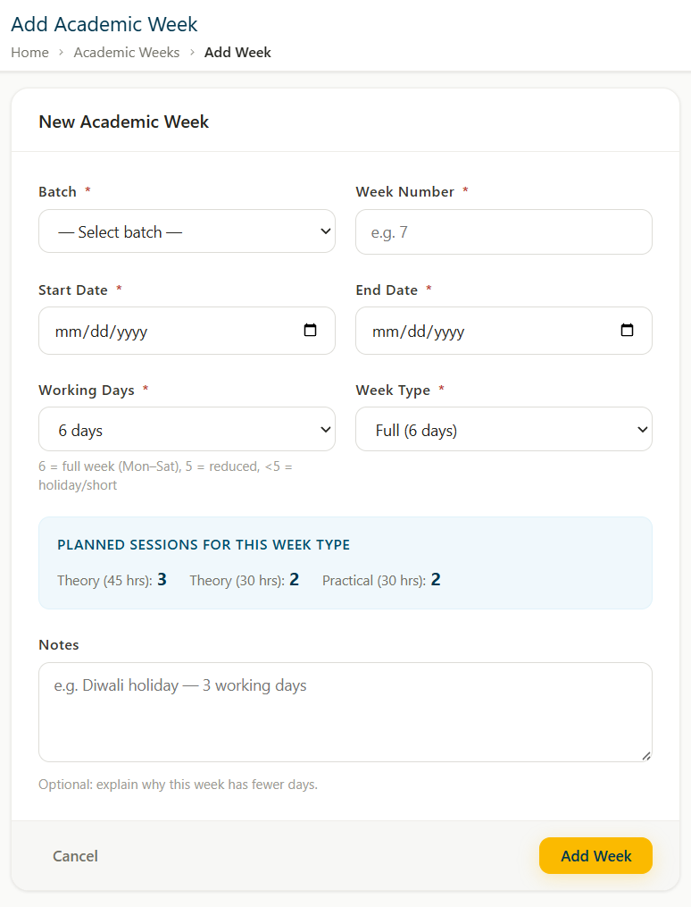`

---

### 3.5 Compliance Auditing & Reporting

At the end of a month or semester, you must audit the submissions.

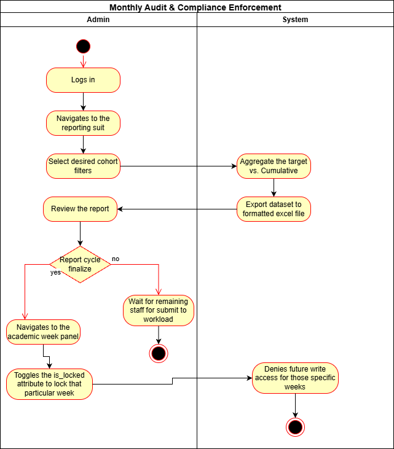`

**Generate a Report:**

1. Navigate to the **Reports** module.
2. Select the desired filters (**Batch**, **Dates**) and click **Generate**.
3. The system will compile cumulative totals (Target vs. Actual) into an **Excel spreadsheet** for download.

   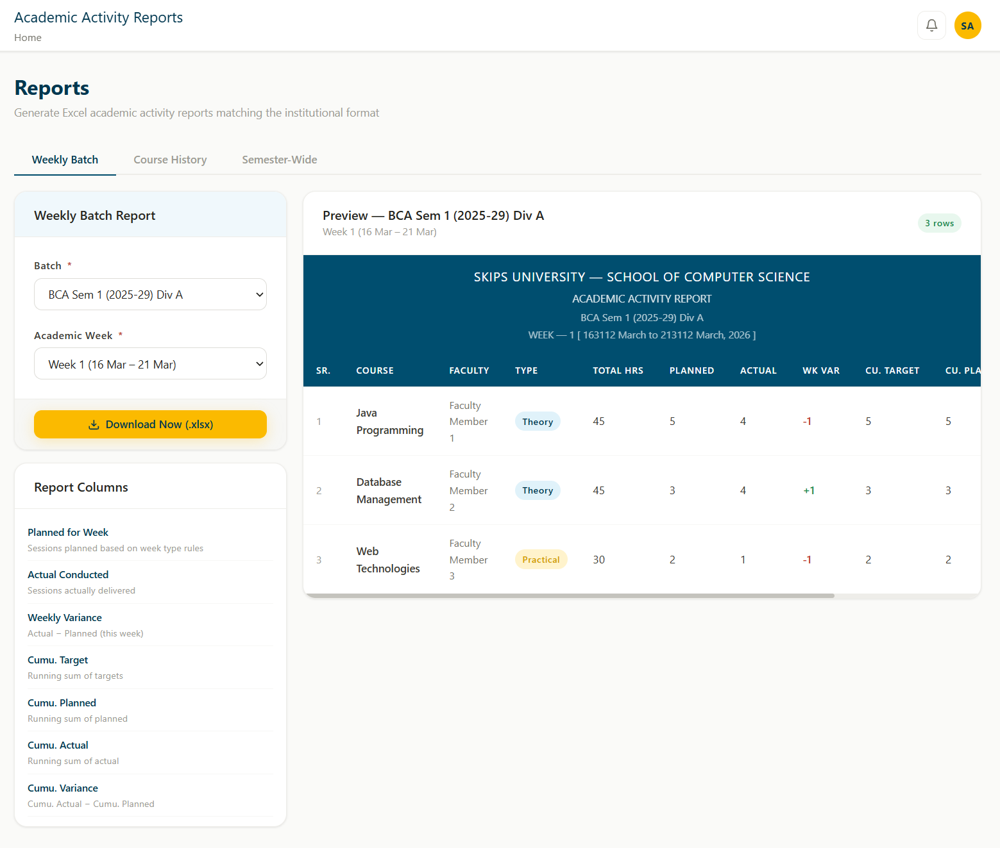`

**Lock Academic Weeks (Critical Step):**

> ⚠️ **CRITICAL:** Once the report is verified, you must lock the past weeks to preserve data integrity.

1. Navigate back to **Academic Weeks**.
2. Click on past weeks and toggle the **Locked** status. This prevents Faculty from retroactively changing data in the system.

   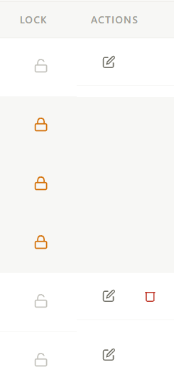`

---

## 4. Faculty (Staff) Guide

As a Faculty member, your primary role in the system is logging your weekly teaching sessions against the system's calculated targets.

---

### 4.1 Flow Overview: Faculty Weekly Session Logging

Review this visual workflow to understand how the system determines what you should log.

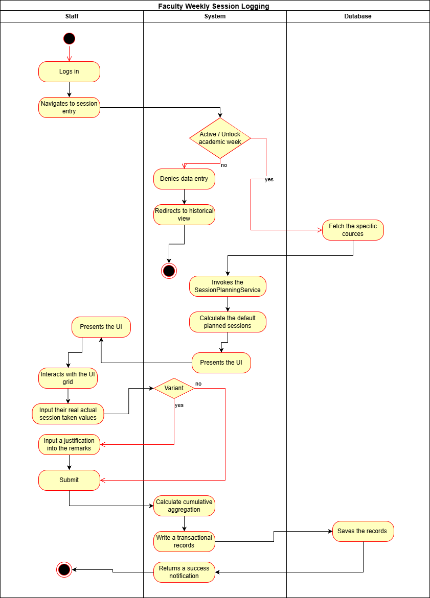`

---

### 4.2 Submitting Weekly Sessions (Step-by-Step)

> ⏰ You are expected to submit your logs **promptly** while the Academic Week is **active (unlocked)**.

1. Log into the system and navigate to the **Log Sessions** module from the sidebar. You will see a history of your past logs on this dashboard.

   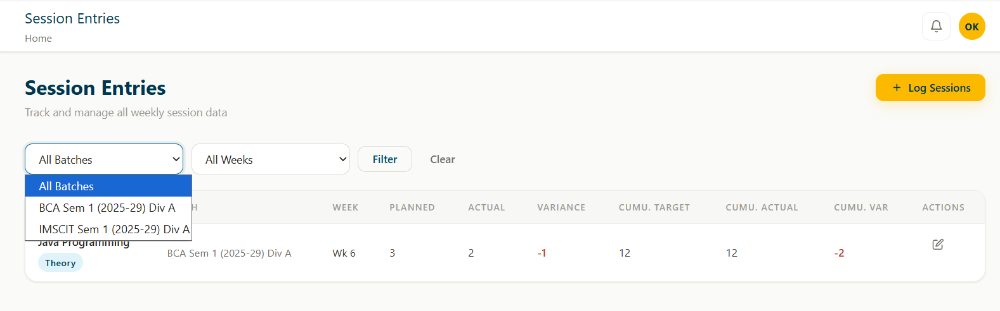`

2. To enter data for the current week, click **Log Session**.

3. **Step 1 — Select Context:** Select the active **Batch** and the active **Academic Week** from the dropdown filters.

   > 🔔 *You will only see Batches/Weeks containing courses assigned specifically to you.*

   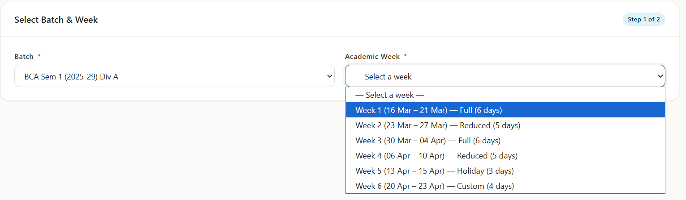`

4. **Step 2 — Enter Session Data:**
   - The system will automatically fetch your assigned courses and populate the **Planned Sessions** field based on the official curriculum hours and week type.
   - Enter the **Actual Sessions** you delivered in the provided input box.
   - If your **Actual** number differs from the **Planned** target (under-delivering or over-delivering), provide a short justification in the **Remarks** column.

   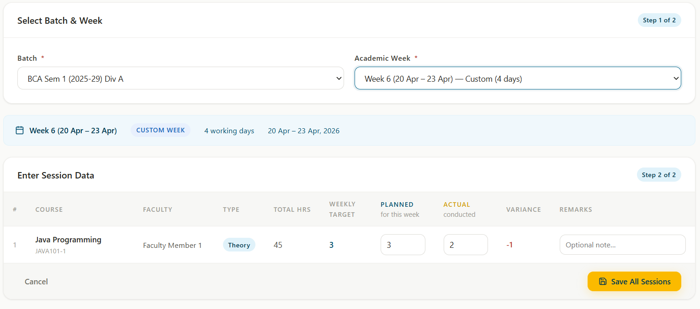`

5. Click **Submit**. The system will save your record and update your cumulative totals instantly.

   > 🔒 *If the week is subsequently locked by an Administrator, this data will become read-only.*

*AAT Usability Document & User Guide.*
